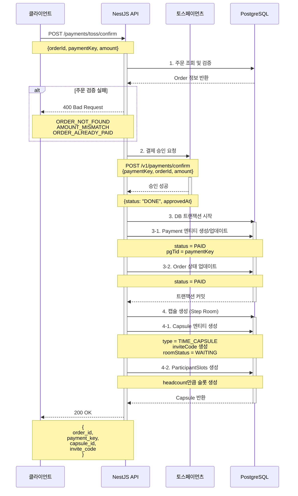
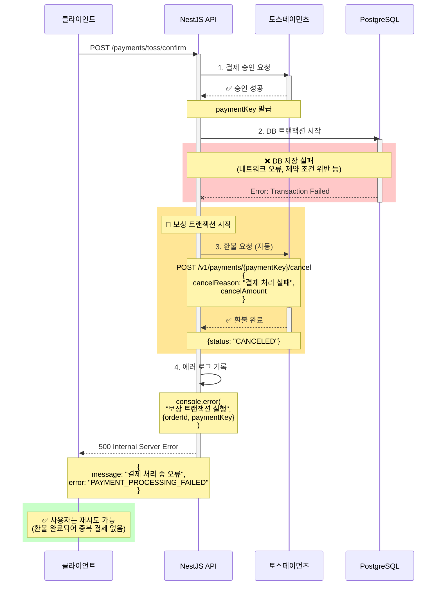
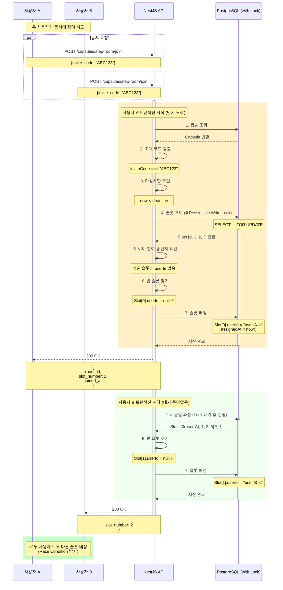
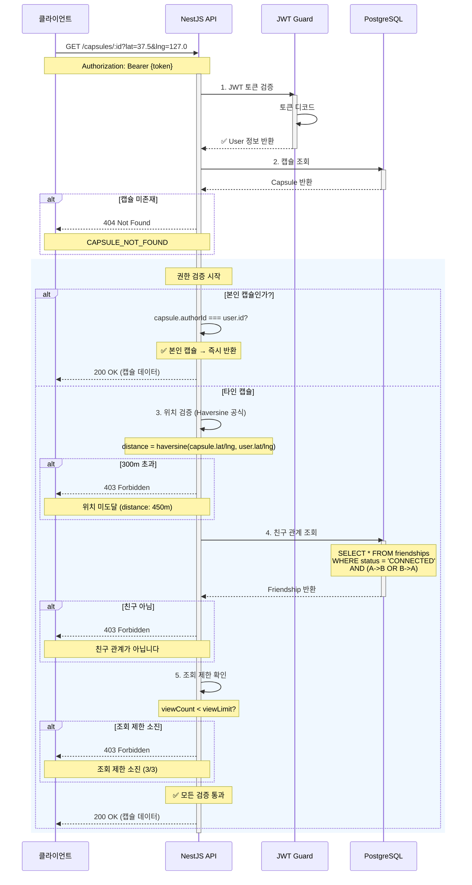
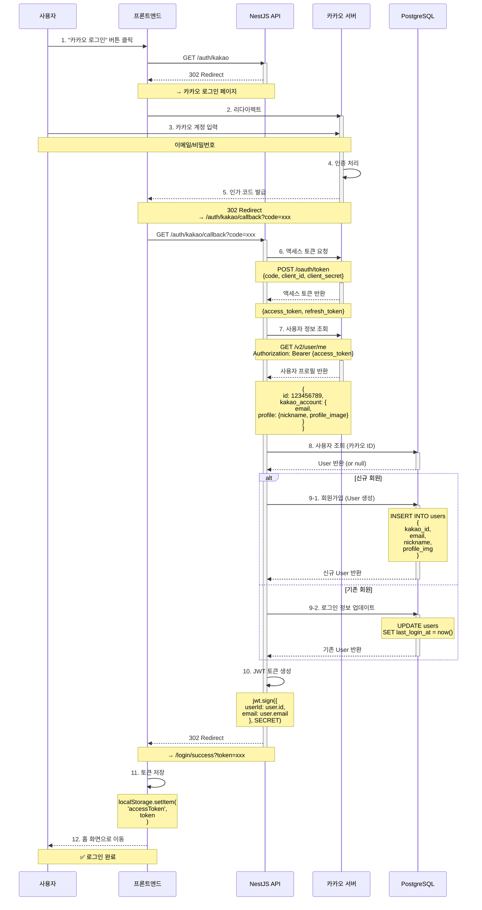
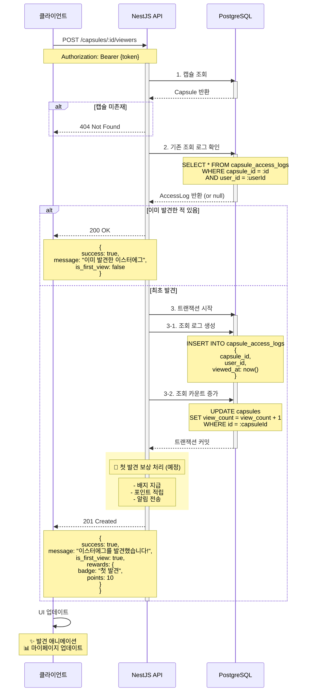
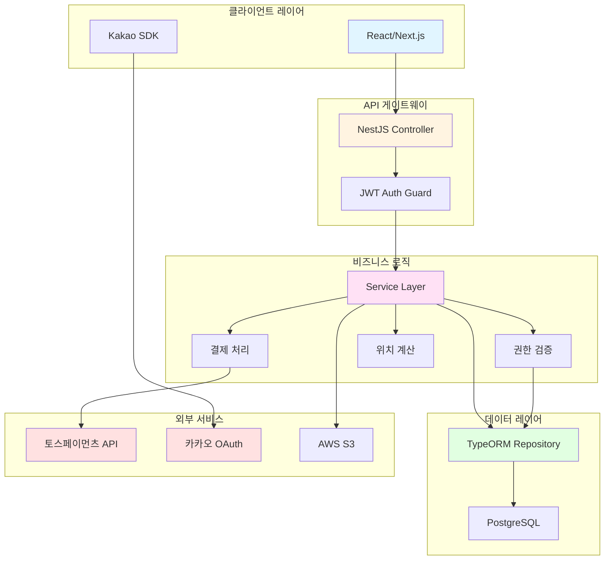
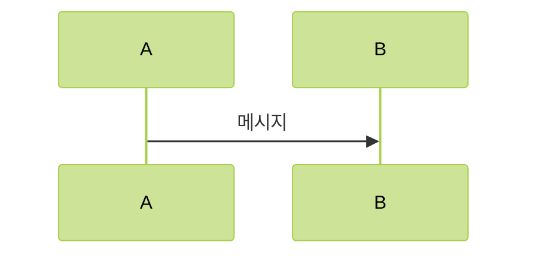
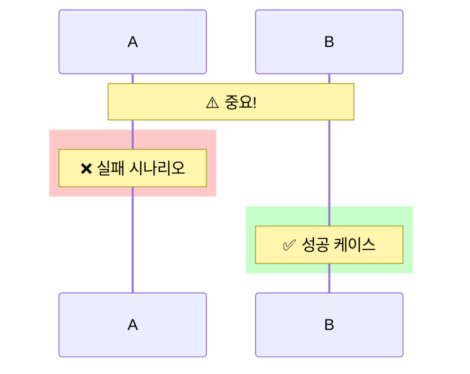

# 🎯 Banny-Banny 핵심 시퀀스 다이어그램

> **프로젝트**: Banny-Banny 타임캡슐 서비스 백엔드  
> **작성일**: 2026-01-12  
> **목적**: 주요 비즈니스 플로우 시각화

---

## 목차
1. [결제 및 타임캡슐 생성 플로우](#1-결제-및-타임캡슐-생성-플로우)
2. [보상 트랜잭션 (결제 실패 처리)](#2-보상-트랜잭션-결제-실패-처리)
3. [Step Room 참여 및 슬롯 배정](#3-step-room-참여-및-슬롯-배정)
4. [이스터에그 조회 및 권한 검증](#4-이스터에그-조회-및-권한-검증)
5. [카카오 OAuth 로그인 플로우](#5-카카오-oauth-로그인-플로우)
6. [이스터에그 발견 기록](#6-이스터에그-발견-기록)

---

## 1. 결제 및 타임캡슐 생성 플로우

### 📝 설명
토스페이먼츠 결제 승인 후 타임캡슐과 Step Room을 생성하는 전체 플로우입니다.



### 🔑 핵심 포인트
- **2단계 커밋 패턴**: PG 승인 → DB 저장 → 캡슐 생성
- **트랜잭션 관리**: 각 단계별 독립적인 트랜잭션
- **멱등성 보장**: 동일 orderId로 중복 승인 방지

---

## 2. 보상 트랜잭션 (결제 실패 처리)

### 📝 설명
결제는 성공했지만 DB 저장 또는 캡슐 생성 실패 시 자동 환불 처리



### 🔑 핵심 포인트
- **Saga 패턴**: 분산 트랜잭션 보상 처리
- **자동 환불**: 실패 시 즉시 토스페이먼츠 API 호출
- **사용자 보호**: 중복 결제 방지, 재시도 가능

---

## 3. Step Room 참여 및 슬롯 배정

### 📝 설명
초대 코드로 타임캡슐 대기실에 참여하고 슬롯을 배정받는 플로우



### 🔑 핵심 포인트
- **Pessimistic Lock**: `SELECT ... FOR UPDATE`로 동시성 제어
- **Race Condition 방지**: 트랜잭션 격리로 슬롯 충돌 없음
- **순차 처리**: 먼저 도착한 요청이 Lock 획득, 나머지는 대기

---

## 4. 이스터에그 조회 및 권한 검증

### 📝 설명
사용자가 이스터에그를 조회할 때 위치, 친구 관계, 조회 제한을 검증하는 플로우



### 🔑 핵심 포인트
- **다중 검증 레이어**: 인증 → 본인 여부 → 위치 → 친구 → 제한
- **Haversine 공식**: 실제 지구 곡률을 고려한 거리 계산
- **조기 반환**: 본인 캡슐은 검증 스킵으로 성능 최적화

---

## 5. 카카오 OAuth 로그인 플로우

### 📝 설명
카카오 소셜 로그인 및 회원가입 통합 플로우



### 🔑 핵심 포인트
- **OAuth 2.0 Authorization Code Flow**: 표준 인증 플로우
- **자동 회원가입**: 신규 사용자 자동 생성 (회원가입 화면 불필요)
- **JWT 토큰 발급**: 이후 API 호출에 사용

---

## 6. 이스터에그 발견 기록

### 📝 설명
사용자가 이스터에그를 발견했을 때 조회 로그를 기록하는 플로우



### 🔑 핵심 포인트
- **중복 방지**: 동일 사용자의 중복 조회 카운트 방지
- **트랜잭션**: 로그 생성 + 카운트 증가 원자성 보장
- **확장 가능**: 보상 시스템 추가 예정 (배지, 포인트)

---

## 📊 아키텍처 전체 플로우



---

## 🎯 다이어그램 사용 가이드

### Mermaid 렌더링 방법

#### 1. **GitHub / GitLab**
- 마크다운 파일에 그대로 푸시하면 자동 렌더링

#### 2. **VS Code**
```bash
# Mermaid Preview 확장 설치
ext install bierner.markdown-mermaid
```
- Ctrl/Cmd + Shift + V로 미리보기

#### 3. **온라인 에디터**
- [Mermaid Live Editor](https://mermaid.live/)
- 코드 붙여넣기 → PNG/SVG 다운로드

#### 4. **Notion / Obsidian**
- Mermaid 블록 지원 (바로 임베드 가능)

---

## 💡 발표 시 활용 팁

### 각 다이어그램의 강조 포인트

| 다이어그램 | 강조할 내용 | 시간 |
|-----------|-------------|------|
| **결제-캡슐 생성** | 분산 트랜잭션, 2단계 커밋 | 2분 |
| **보상 트랜잭션** | Saga 패턴, 자동 환불 | 2분 |
| **Step Room** | 동시성 제어, Pessimistic Lock | 1.5분 |
| **권한 검증** | 다중 레이어 검증, 보안 | 1.5분 |
| **OAuth** | 표준 인증 플로우 | 1분 |

### 발표 스크립트 예시

> "이 다이어그램은 결제와 캡슐 생성의 전체 플로우입니다. 
> 
> 특히 **보상 트랜잭션** 부분을 주목해주세요. PG 승인은 성공했지만 DB 저장이 실패하면, 자동으로 환불 API를 호출합니다. 이는 **Saga 패턴**을 적용한 것으로, 분산 시스템에서 데이터 일관성을 보장하는 핵심 기법입니다.
>
> 사용자는 에러를 받더라도 중복 결제 걱정 없이 재시도할 수 있습니다."

---

## 🎨 커스터마이징

### 색상 테마 변경



**테마 옵션**: `default`, `dark`, `forest`, `neutral`

### 노트 강조



---

## 📚 참고 자료

- [Mermaid 공식 문서](https://mermaid.js.org/)
- [Sequence Diagram Syntax](https://mermaid.js.org/syntax/sequenceDiagram.html)
- [Draw.io 대안 비교](https://www.diagrams.net/)

---

**작성일**: 2026-01-12  
**프로젝트**: Banny-Banny Backend  
**다이어그램 수**: 6개 (+ 1개 아키텍처 그래프)
